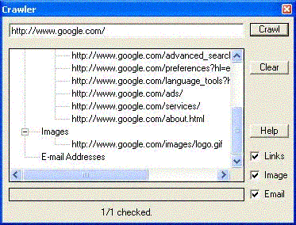



## Crawler \(HTML Tags, Links, Emails, Images\)

### Description

Search Tags (user-inputted) on a link (such as ones to search for Images, Links, Emails, and things of such sort). The form is just a sample for the module contained in it, because this project can be expanded to do things as far as performing actions on the returned results such as sending mail to all the e-mail's collected, searching links for specific text, downloading all the images off of a site onto your pc, and such sort of things. Sorry for the repeatted posts, it didn't seem like they were coming up so I posted agian, but I deleted them now. I also updated the zip file to not have the screenshots so it's much smaller. I updated it... Those bugs I listed are now fixed.
 
### More Info
 

             |
---                |---
**Submitted On**   |2004-06-10 13:04:44
**By**             |[Lohrbas](https://github.com/Planet-Source-Code/PSCIndex/blob/master/ByAuthor/lohrbas.md)
**Level**          |Intermediate
**User Rating**    |5.0 (20 globes from 4 users)
**Compatibility**  |VB 6\.0
**Category**       |[Jokes/ Humor](https://github.com/Planet-Source-Code/PSCIndex/blob/master/ByCategory/jokes-humor__1-40.md)
**World**          |[Visual Basic](https://github.com/Planet-Source-Code/PSCIndex/blob/master/ByWorld/visual-basic.md)
**Archive File**   |[Crawler\_\(H1755896102004\.zip](https://github.com/Planet-Source-Code/lohrbas-crawler-html-tags-links-emails-images__1-53567/archive/master.zip)

